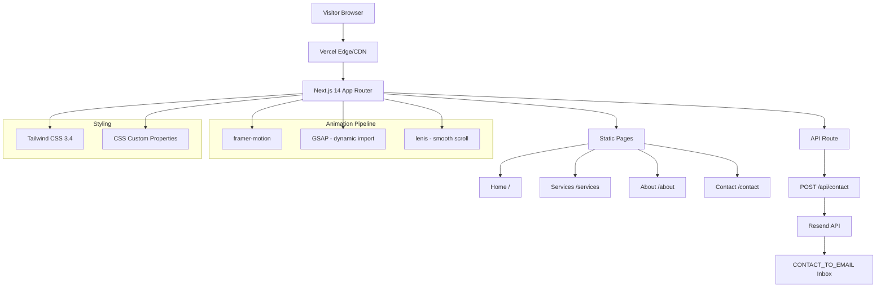

# Technology Stack

Nyota Tech's marketing site is a **Next.js 14** App Router application
written in **TypeScript** with **Tailwind CSS** for styling and a layered
motion pipeline.

## Dependency Tree

### Framework & Core

| Dependency | Version | Role |
|------------|---------|------|
| `next` | 14.2.35 | React meta-framework (App Router) |
| `react` / `react-dom` | ^18 | UI runtime |
| `typescript` | ^5 | Type safety |
| `tailwindcss` | ^3.4.1 | Utility-first CSS |
| `postcss` | ^8 | CSS processing |

### Animation Pipeline (three layers)

| Library | Version | Role |
|---------|---------|------|
| `framer-motion` | ^12.38.0 | Page transitions, scroll-triggered
  reveals (SplitText, RevealOnScroll), AnimatedStat counter (spring
  physics), mobile menu |
| `gsap` | ^3.15.0 | Magnetic button elastic pull effect (loaded
  dynamically, no SSR) |
| `lenis` | ^1.3.23 | Smooth scroll engine with `smoothWheel: true`,
  duration 1.1s |

### Email / Contact

| Integration | Method | Purpose |
|-------------|--------|---------|
| Resend | `fetch()` to `https://api.resend.com/emails` | Contact form
  delivery — no SDK dependency |

## Architecture Diagram

## API Surface

The application exposes a single API endpoint:

| Method | Path | Purpose | Rate Limiting |
|--------|------|---------|---------------|
| POST | `/api/contact` | Accepts `{name, email, message}` and relays to
  Resend | ⚠ Not implemented |
| GET | — | No public read endpoints; all content pages are statically
  rendered or server-rendered |

The API route (`app/api/contact/route.ts`) uses `runtime = "nodejs"` and
returns the following HTTP status codes:

- `200` — Successfully sent
- `400` — Invalid JSON or missing/invalid fields
- `503` — Missing environment variables (RESEND_API_KEY,
  CONTACT_FROM_EMAIL, CONTACT_TO_EMAIL)
- `502` — Resend upstream error

## Third-Party Integrations

### Confirmed Integrations (from `.env.example`)

| Variable | Service | Purpose |
|----------|---------|---------|
| `RESEND_API_KEY` | Resend | Transactional email API |
| `CONTACT_FROM_EMAIL` | Resend sender | Verified sender address |
| `CONTACT_TO_EMAIL` | — | Inbox for contact submissions |
| `NEXT_PUBLIC_SITE_URL` | Vercel / custom | Canonical URL for metadata |

### Inferred Integrations

| Signal | Service | Evidence |
|--------|---------|----------|
| WhatsApp | WhatsApp Business API | `wa.me/260973971192` link in footer
  and contact page (`SOCIAL_LINKS` in `lib/constants.ts:51`) |
| Vercel | Vercel Platform | `DEPLOYMENT.md`, `.vercel/project.json`,
  `VERCEL_URL` env var reference |
| LinkedIn / X | Social presence | Links in `SOCIAL_LINKS` array |

### Not Present

The following were checked for but **not found** in the codebase:

- No Stripe / payment keys
- No database connection strings
- No AI/ML service keys
- No analytics script tags or measurement IDs
- No CMS integration
- No monitoring/observability tooling in app code
- No authentication provider

---

## References

- `package.json` — Full dependency tree
- `app/api/contact/route.ts` — API implementation, response codes
- `.env.example` — Environment variable reference
- `lib/constants.ts:50-54` — SOCIAL_LINKS array
- `DEPLOYMENT.md` — Vercel and Resend setup instructions
- `.vercel/project.json` — Vercel project ID and org ID
- `next.config.mjs` — Empty config (no plugins, no rewrites)
